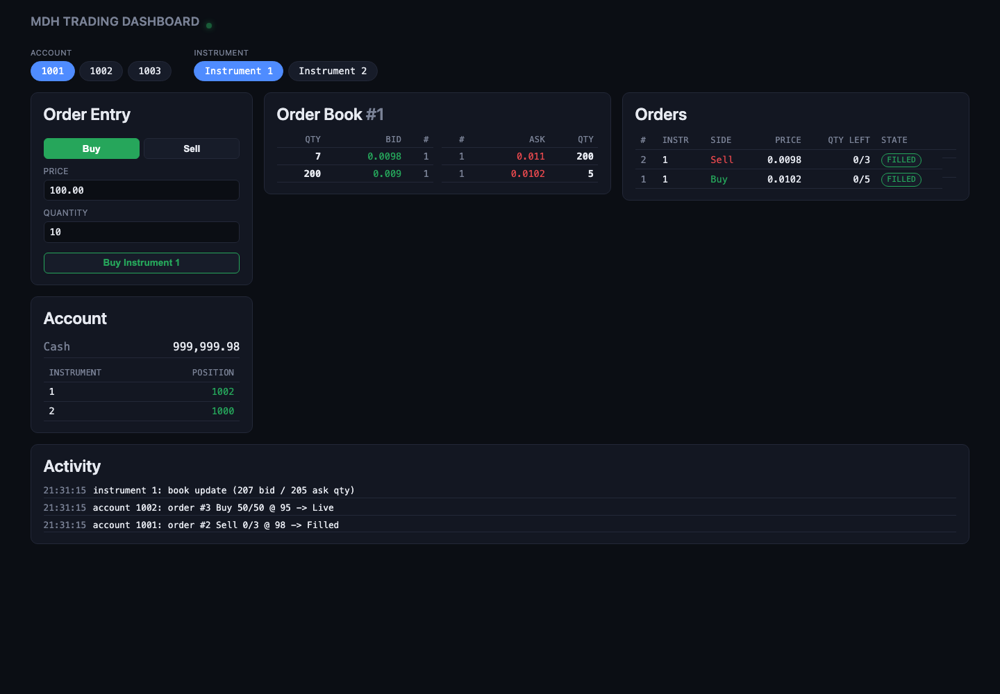

# Live demonstration

**Status:** actually run, once, end to end, on this machine, on 2026-08-09 -- every
number, log line, and the screenshot below are real output from that run, not
illustrative/hypothetical -- same documentation discipline `docs/benchmarks.md` and
`docs/failure_injection.md` apply to their own claims.

This is the capstone: a live strategy trading with real UI activity. It ties together
everything in the repository into one running system: a real exchange, a
real browser dashboard, a real market-making strategy, and a real human-shaped trader
(driven here by `curl`, exercising exactly the same REST surface a person clicking
the dashboard would) all interacting over real sockets at the same time.

---

## 1. What's actually running, and how it's wired

```
apps/trading_server
    OrderEntryGateway  --tcp:7100-------------------+
         |                                          |
         +--extra_event_sink--> MarketDataPublisher |
                                      |              |
                                     udp:7101         |
                                      |              |
                                  UiGateway ----------+  (its own Sessions connect back over tcp:7100)
                                      |
                                 http:8180  (serves ui/dist AND the JSON/SSE API)
                                      |
              +---------------------+----------------------+
              |                                             |
   a browser (headless Chrome, this demo)          apps/live_strategy_demo
   GET/POST /api/*, GET /api/stream                  tcp:7100 (real order flow, account 9001)
   -- exactly what a human at the                     http:8180 GET /api/book/1 (polls the
   dashboard would do                                 UI gateway's own live-reconstructed book)
```

`apps/live_strategy_demo` is the piece that closes the gap between the strategy
runtime and a live, running exchange process: for a long time the strategy layer was
only ever exercised in-process, against synthetic events or a book the test built by
hand. It wires a real `MarketMakerStrategy` to a real, running `trading_server` -- trading
through a real `TraderRiskGatedOms`/`OrderEntryClient` pair over TCP, quoting off the
book it gets by polling `UiGateway`'s own `GET /api/book/:id` (see that app's own
top-of-file comment for why polling the already-tested REST endpoint was chosen over
standing up a second UDP subscriber socket, which would have been new production
networking work rather than a demo).

## 2. How to reproduce this yourself

```bash
# 1. Build everything in Release (see docs/benchmarks.md's own note on why Release,
#    not Debug, matters for anything you actually want to watch behave normally).
cmake -S . -B build-release -DCMAKE_BUILD_TYPE=Release
cmake --build build-release -j --target trading_server live_strategy_demo

# 2. Build the dashboard once.
cd ui && npm install && npm run build && cd ..

# 3. Start the server, serving the dashboard too.
./build-release/trading_server --tcp-port 7100 --market-data-port 7101 \
    --http-port 8180 --static-dir ui/dist &

# 4. Seed an initial two-sided market from a demo account (a human/LP move) --
#    exactly what §3 step 1 below does.
curl -s -X POST http://127.0.0.1:8180/api/orders -H "Content-Type: application/json" \
    -d '{"account_id":1002,"instrument_id":1,"side":"Buy","price":90,"quantity":200,"time_in_force":"GTC"}'
curl -s -X POST http://127.0.0.1:8180/api/orders -H "Content-Type: application/json" \
    -d '{"account_id":1002,"instrument_id":1,"side":"Sell","price":110,"quantity":200,"time_in_force":"GTC"}'

# 5. Start the live strategy.
./build-release/live_strategy_demo --tcp-port 7100 --http-port 8180 --account 9001 \
    --instrument 1 --quote-size 10 --half-spread 2 --max-position 2000 \
    --requote-threshold 2 &

# 6. Open http://127.0.0.1:8180/ in a browser, or trade against the strategy yourself:
curl -s -X POST http://127.0.0.1:8180/api/orders -H "Content-Type: application/json" \
    -d '{"account_id":1001,"instrument_id":1,"side":"Buy","price":102,"quantity":5,"time_in_force":"IOC"}'
```

## 3. What this run actually did, step by step

1. **Seeded an initial wide market** via `POST /api/orders` as account 1002 (one of
   `UiGatewayOptions::demo_account_ids`): bid 200 @ 90, ask 200 @ 110 -- the same
   "LP establishes a wide market" setup step `tests/test_market_maker_strategy_e2e.cpp`
   already uses, done here over the real REST API instead of in-process.
2. **Started the live strategy** (`live_strategy_demo`, account 9001, `half_spread=2`).
   Within one poll cycle it read the book (bid 90/ask 110, mid 100) and placed real
   `NewOrder`s: bid 10 @ 98, ask 10 @ 102 -- verified directly against the real,
   running gateway:

   ```json
   {"asks":[{"order_count":1,"price":102,"quantity":10},{"order_count":1,"price":110,"quantity":200}],
    "bids":[{"order_count":1,"price":98,"quantity":10},{"order_count":1,"price":90,"quantity":200}],
    "instrument_id":1}
   ```
3. **A second demo account crossed the strategy's ask** -- account 1001 sent a real
   `IOC Buy 5 @ 102`, filling 5 of the strategy's 10-lot resting ask:

   ```json
   {"account_id":1001,"cash":9999999490,
    "orders":[{"client_order_id":1,"side":"Buy","price":102,"quantity":5,"remaining_quantity":0,"state":"Filled", ...}],
    "positions":[{"instrument_id":1,"quantity":1005},{"instrument_id":2,"quantity":1000}]}
   ```

   `live_strategy_demo`'s own status line, printed on its very next poll tick, shows
   the fill landing on the *strategy's* side of the same trade in real time:

   ```
   [live_strategy_demo] position(1)=995 cash=10000000510 bid=98x10 ask=102x5
   ```

   (position 1000 → 995 -- sold 5; cash +510 = 5 × 102 -- both exactly consistent
   with the other side of account 1001's fill above, computed completely
   independently by two different processes reconciling the same trade.)
4. **Account 1001 then crossed back the other way** -- `IOC Sell 3 @ 98`, filling 3 of
   the strategy's bid. `live_strategy_demo`'s status line on the next tick:

   ```
   [live_strategy_demo] position(1)=998 cash=10000000216 bid=98x7 ask=102x5
   ```

   (995 + 3 = 998 -- bought back 3; the shown cash is the running total starting from
   the 10,000,000,000-tick seed: +510 from step 3's sale, then −294 = 3 × 98 for this
   buy-back, net +216 → 10,000,000,216, exactly the value printed above.)
5. **A screenshot of the live dashboard** (headless Chrome, `http://127.0.0.1:8180/`,
   default-selected account 1001/instrument 1 -- see `ui/src/hooks/useDashboard.ts`'s
   own default-selection logic) was captured at this point in the run:

   

   Reading this screenshot against the raw JSON above, everything lines up:
   - **Order Book #1** shows bid 98×7 / ask 102×5 exactly as computed in step 4.
   - **Orders** (account 1001) shows both fills from steps 3-4: `Sell 0/3 @ 98 ->
     Filled` and `Buy 0/5 @ 102 -> Filled`.
   - **Account** shows position 1002 in instrument 1 (1000 seed + 5 bought − 3 sold)
     and the correspondingly reduced cash.
   - **Activity** (the SSE feed, `GET /api/stream`) shows the live book-update and
     order-fill events arriving in real time, with no page refresh -- proving the
     push channel, not just the REST snapshot endpoints, is live.
6. **Shutdown**: `SIGINT` to both processes. `trading_server`'s own log confirms a
   clean stop (`ui.stop()` then `gateway.stop()`, per its own documented order):

   ```
   order-entry gateway listening on tcp:7100
   ui gateway listening on http:8180 (market data on udp:7101)
   demo accounts: 1001 1002 1003
   live-strategy-demo account: 9001 (see apps/live_strategy_demo)
   press Ctrl+C to stop

   shutting down...
   ```

## 4. What this demonstrates, concretely

- **A real strategy, unmodified from the version tested in-process, trades
  correctly against a real, running exchange process** -- the
  same `MarketMakerStrategy` class, the same quoting math (mid ± `half_spread`,
  requote only past `requote_threshold`), now proven against a live book fetched
  over a real network call instead of a hand-fed local mirror.
- **Two independent processes (the strategy and the exchange/UI stack) agree on
  every fill's price, quantity, and resulting position/cash**, computed completely
  separately (one from `TraderRiskGatedOms`'s local OMS bookkeeping, the other from
  `exchange::ledger::Ledger`'s exchange-side settlement) -- concrete evidence the
  order-entry wire protocol, matching engine, and both sides' fill-accounting logic
  agree with each other under real, not simulated, conditions.
- **A real dashboard, opened in a real (headless) browser, shows this activity live**
  -- the book panel, the orders panel, the account panel, and the SSE-driven activity
  feed are all showing state that was produced by a genuine trading strategy actually
  running against the actual exchange, not seeded test fixtures.
- **The whole stack starts up and shuts down cleanly** under the exact sequencing each
  component's own class documents (`OrderEntryGateway::stop()`'s 5-step order,
  `UiGateway::stop()` before `gateway.stop()` in `trading_server`'s own `main()`).

## 5. Known, deliberate scope limits of this demo (documented, not hidden)

- **One demo run, one machine, one screenshot** -- this is a demonstration that the
  system *works end to end*, not a long-running soak test or a load test (that is
  `docs/benchmarks.md`'s job) or a fault-tolerance proof (that is
  `docs/failure_injection.md`'s job).
- **`live_strategy_demo` polls the book over REST rather than subscribing to the raw
  UDP feed directly** -- a deliberate, documented simplification for a demo binary
  (see that app's own top comment); a "real" HFT-style strategy would want the raw
  feed's lower latency, which would require teaching `MarketDataPublisher` to fan out
  to more than one destination port, real production work out of scope here.
- **The IOC orders in step 3/4 above are logged by the UI's Activity feed as
  transitioning straight to a state that never shows an explicit "Cancelled" for any
  unfilled remainder** -- this is pre-existing, documented matching-engine behavior,
  not a bug introduced by the demo: `MatchingEngine::rest_remainder_if_applicable()`
  and `Ledger::on_order_accepted()` both explicitly skip any bookkeeping for an
  IOC/FOK order's unfilled remainder ("any remainder is discarded silently -- never
  accepted as resting, so there is nothing to announce" -- `matching_engine.cpp`'s own
  comment), so no second event is ever sent to mark it terminal.
